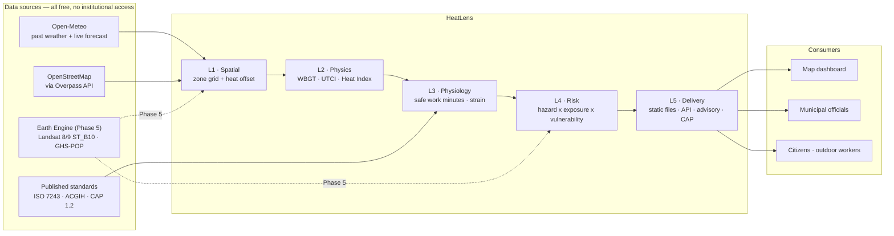
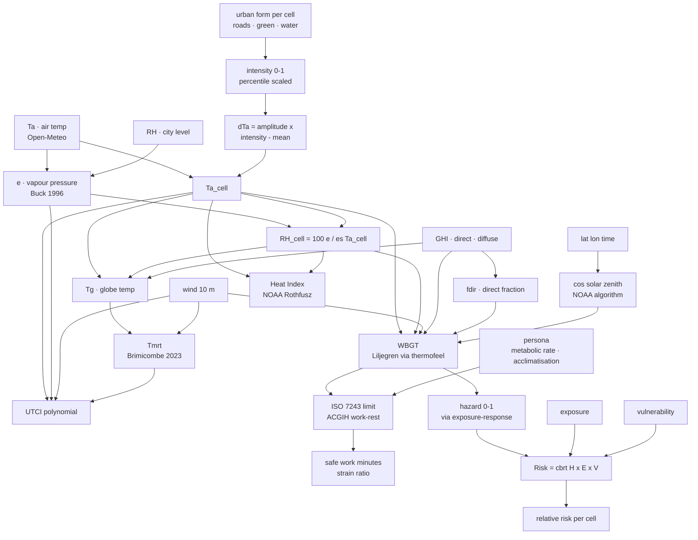
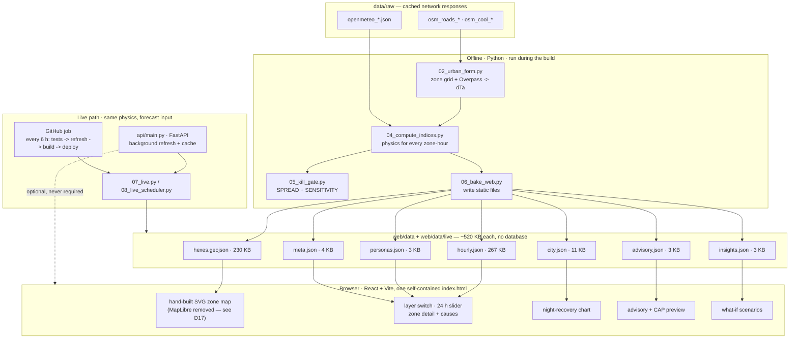
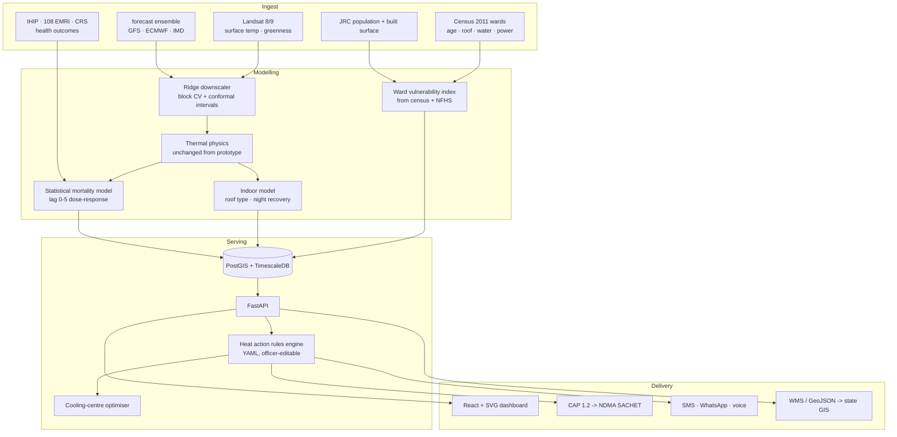
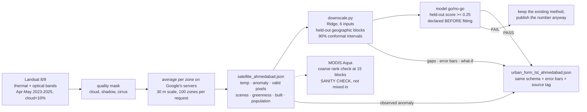

# System Architecture
## HeatLens — Human Thermal Stress Index

This document describes the system **as it actually is**, and marks clearly anywhere a design is planned rather than built. Where what we built differs from what we originally planned, the change and the reason are both recorded — those differences are among the most defensible parts of the work.

**On the name:** the product is **HeatLens**. The Python package is `heatstress`. That mismatch is deliberate and must not be "fixed" — renaming the package would break every import and all file history for nothing a user would ever see.

**Status markers:** ✅ built · 🚧 being built now (Phase 5) · ⬜ future `[V1]`

> **If you are new to this project**, read §0 (which requirement each part answers), then §2 (the physics, which is the heart of it), then §6 (why things are the way they are). Technical terms are defined in the glossary in `PRD.md` Part III.

---

## 0 · Requirement map — problem statement to subsystem

**The problem statement comes first.** Its clauses are numbered PS-1 to PS-13 in `PRD.md` §1, which holds the authoritative status of each. This table says *which part of the architecture answers each one*, so the two documents can be read side by side.

| # | Problem statement clause | Layer | Where it lives | Status |
|---|---|---|---|---|
| PS-1 | Thermal stress index from temperature + humidity + wind + radiation | **L2** | `thermal.py`, `psychro.py`, `solar.py` — see §2 | ✅ |
| PS-2 | WBGT / UTCI / Heat Index rather than temperature alone | **L2** | All three, each with a second independent implementation — §5.1 | ✅ |
| PS-3 | Automated **Mortality Risk Index** | **L4** | `risk.py` — fully built, `is_calibrated=False` on purpose. **PRD §3.1** | ⚠️ relative risk only |
| PS-4 | Historical public health data | **L4** | `risk.ExposureResponse.calibrate()` — the connection point, unfilled | ⬜ no data access |
| PS-5 | Demographics — elderly / outdoor-worker density | **L4** | `vulnerability.py`; Phase 5E adds population counts with no age split — §9 | ⚠️🚧 |
| PS-6 | Localized weather data | **L1** | `sources/openmeteo.py` — past and forecast, with unit checks | ✅ |
| PS-7 | Predict spikes **3–5 days ahead** | **L1→L3** | 6-day forecast through the same physics; `live.py` republishes — §3, §4 | ⚠️ lead time ✅, heat stress ✅, death counts ⬜ |
| PS-8 | High-resolution, hyper-local (zone / ward) | **L1** | `spatial.py` — 392 zones at 0.693 km²; `03_place_names.py` names them. Phase 5 measures the pattern from satellite — §9 | ✅ |
| PS-9 | Dynamic colour-coded map dashboard | **L5** | `frontend/` — hand-built SVG map; MapLibre was removed (D17) — §3 | ✅ |
| PS-10 | Actionable automated public health advisories | **L5** | `advisory.py` (text + CAP), `insight.py` (causes, scenarios, actions) | ✅ |
| PS-11 | **API** able to push SMS/WhatsApp alerts | **L5** | `api/main.py` — 26 read routes (D16); CAP message valid; **send switched off on purpose. PRD §3.2** | ⚠️ |
| PS-12 | Triggers: cooling centres · power grid · work hours | **L3, L5** | Work hours ✅ `physiology.py` + `insight.scenario_shift_hours`; cooling centres 🚧 `siting.py` (§9); grid ⬜ | ⚠️ |
| PS-13 | Serve municipal / health / disaster authorities | **L5** | Role-specific views in `frontend/src/components/` | ✅ |

**The whole architecture in one sentence:** L1 works out *where*, L2 works out *how bad that is for a human body*, L3 turns that into *how long a person can safely work*, L4 combines it with *who is exposed* — labelled honestly where it is not calibrated — and L5 delivers the result in a form that works with no internet.

---

## 1. System context

What comes in, what we do with it, who receives it. Everything on the left is free and needs no institutional permission, which is what makes the system portable to another city.



---

## 2. The physics — the heart of the system

**In plain terms:** weather arrives for the city as a whole. We work out how much hotter each zone is than average, adjust the air temperature for that zone, **recompute the humidity correctly for the new temperature** (this is the subtle part), and then run three separate heat-stress calculations. Those feed two outputs: how long a person can safely work, and a relative health-risk score.

Everything downstream of this is presentation.



### 2.1 The humidity decision — the subtlest thing in the design

**The problem.** When a neighbourhood is hotter than the city average, **it does not contain more water**. Hot tarmac warms the air; it does not add moisture to it.

Relative humidity is a percentage *of what the air could hold at that temperature*, and warmer air can hold more. So if you warm a zone and keep relative humidity fixed, you have silently invented extra water in exactly the hottest zones.

**What we do instead.** We carry **vapour pressure** — the actual water content, which genuinely does not change when air warms — across zones, and recompute relative humidity per zone from it:

```
RH_cell = 100 · e_city / es(Ta_cell)
```

**Why it matters so much.** Getting this wrong would have *inflated* the humid heat stress in the hottest zones — making our results look more dramatic and more convincing. An error that flatters your own conclusion is the most dangerous kind, because nothing about the output looks wrong.

### 2.2 A measured consequence: WBGT hides the variation, UTCI reveals it

Feed the same 3.00 °C temperature difference across the city into all three indices and they disagree sharply:

| metric | spread across the city | ratio to air temperature |
|---|---|---|
| air temperature | 3.00 °C | 1.00 |
| **WBGT** | **1.39 °C** | **0.46 — shrinks it** |
| **UTCI** | **3.88 °C** | **1.29 — magnifies it** |
| Heat Index | 3.10 °C | 1.03 |

**Why.** A hotter zone is a *drier* zone (§2.1), and WBGT is 70 % weighted on the wet-bulb reading — so its temperature and humidity terms partly cancel out. UTCI is driven by air temperature and radiant heat, so it does the opposite.

**What this means for the architecture:** the map layer is not a fixed choice. For a dry heatwave UTCI is the right layer; for a humid one WBGT is. Index selection is per city and per event. *(A later live run showed the shrinking effect does not in fact depend on humidity — see `IMPLEMENTATION_PLAN.md` §4.2. The recommendation survives and gets stronger; the reasoning behind it changed.)*

### 2.3 What the spatial input actually contains — a defect on the record

The formula for how built-up a zone is reads `0.55·buildings + 0.25·roads − 0.30·greenery − 0.20·water`. But building data is switched off, so **the buildings term is 0.0 in all 392 zones**. The largest weight in the core formula contributes nothing, and the formula collapses to the other three terms.

Measured on the data we actually ship:

```
correlation with roads    = +0.855
correlation with water    = -0.778
correlation with greenery = -0.286
greenery is non-zero in only 175 of 392 zones
```

**So the spatial pattern this system currently shows is, to a good approximation, road density.** That is stated rather than quietly fixed by re-weighting, and it is the defect that motivates Phase 5 (§9): measure the pattern from satellite surface temperature instead of inferring it from hand-chosen weights.

---

## 3. Delivery — offline first, with an optional API

**The guarantee:** the offline build is what satisfies NFR-1 and what runs on stage. A FastAPI service was added later for live forecasts and for browser clients that do have a network, and it is deliberately **never something the demo depends on** — the page works perfectly with the backend switched off, and panels that need it hide themselves when it is unreachable.



**Why offline first.** For a fixed historical date, every number is computed in advance and never changes. A static page is simpler, looks better than a notebook, and — decisively — **cannot fail on stage**. NFR-1 is satisfied by construction, not by discipline.

**Why the data is compiled into the page rather than fetched.** Browsers block both `fetch()` and module scripts when a page is opened directly from a local file. So the seven data files are built *into* the bundle. The consequence to remember: **re-baking data also requires `npm run build`**, or the page keeps showing the old numbers.

**Two data folders, always baked together.** `web/data/` holds the 2010 historical event; `web/data/live/` holds the current forecast. Both contain the same seven files. If you bake one without the other, the two dataset tabs disagree — which has already happened once, and is recorded in `live.py`'s own docstring.

---

## 4. Data flow, step by step

```mermaid
sequenceDiagram
    autonumber
    participant Dev as Operator
    participant OM as Open-Meteo
    participant OV as Overpass
    participant Core as heatstress core
    participant Web as web/data

    Dev->>Core: 02_urban_form.py
    Core->>Core: divide the city bbox into zones
    loop 16 tiles, each cached separately
        Core->>OV: roads (out geom)
        Core->>OV: green + water (one request, split by tag)
        OV-->>Core: vectors  (504s retried with backoff)
    end
    Core->>Core: percentile scale -> intensity -> dTa
    Core-->>Dev: urban_form_<city>.json

    Dev->>Core: 04_compute_indices.py
    Core->>OM: hourly data for the window
    OM-->>Core: T, RH, wind, GHI, direct, diffuse, pressure
    Core->>Core: Ta_cell; recompute RH at constant vapour pressure
    Core->>Core: Liljegren WBGT · UTCI · Heat Index · risk
    Core-->>Dev: indices_<city>.npz  (392 x 264 zone-hours)

    Dev->>Core: 05_kill_gate.py
    Core-->>Dev: spread, ratios, sensitivity sweep, VERDICT

    Dev->>Core: 06_bake_web.py
    Core->>Web: 7 static files, ~520 KB
    Web-->>Dev: opens from a local file with the network off

    Note over Core,Web: Live path — same physics, forecast input
    Dev->>Core: 07_live.py (or FastAPI's loop, or the 6-hourly job)
    Core->>OM: forecast, refetched when older than max_age_minutes
    Core->>Core: same pipeline; focus hour = peak stress hour AHEAD
    Core->>Web: atomic rewrite of web/data/live/ (meta written last)
```

---

## 5. What each file does

```
src/heatstress/            (the Python package; the product is HeatLens)
├── psychro.py        Humidity maths: saturation vapour pressure (Buck 1996),
│                     wet bulb (Stull), dew point, specific humidity
├── solar.py          Where the sun is (NOAA algorithm) and how much of the
│                     sunlight is direct beam vs diffuse sky (Erbs 1982)
├── thermal.py        The three heat indices: Heat Index (our own Rothfusz),
│                     globe temperature, mean radiant temperature (ISO 7726),
│                     WBGT, thermofeel wrappers (Liljegren, UTCI), severity bands
├── physiology.py     Person types, ISO 7243 limits, ACGIH work/rest split,
│                     strain ratio, per-person assessment
├── spatial.py        Zone grid, GeoJSON output, UrbanIntensity, the heat
│                     offset, and the UrbanFormSource plug-in interface
├── vulnerability.py  Vulnerability surface, the declared placeholder,
│                     IPCC risk combination
├── risk.py           Dose-response, relative risk, lag kernel, hazard
│                     scaling, and the calibrate() connection point
├── advisory.py       Warning text in three languages, severity bands,
│                     CAP 1.2 XML output
├── insight.py        Cause attribution, what-if scenarios (shift hours,
│                     shade, greening), recommended actions, and an explicit
│                     list of what is deliberately NOT offered
├── live.py           Live forecast orchestration: refresh loop, freshness
│                     policy, cross-process lock, atomic seven-file publish,
│                     the PAYLOAD_FILES contract  (largest module, 26 KB)
└── sources/
    ├── openmeteo.py  Past + forecast weather client, cached to disk, units
    │                 asserted (m/s, not the km/h default)
    └── osm.py        Overpass client: tiling, backoff, endpoint rotation,
                      percentile scaling

api/
├── main.py           FastAPI app. A background task shares refresh_once with
│                     the scheduler under a lock, so only one of them computes
│                     per cycle. The payload cache is replaced in a single
│                     assignment, so a request always sees one complete
│                     payload — unlike seven separate file writes. Falls back
│                     to reading from disk.
└── services/engine.py

frontend/              React + TypeScript + Vite -> one self-contained index.html
├── src/components/    AppShell · HexMap · CellDetail · ZonePicker · KpiRow ·
│                      Drivers · Scenarios · ActionList · IndexComparison ·
│                      NightRecovery · SafeWorkGrid · AdvisoryPanel ·
│                      ProvenancePanel · Explainer · CityVisual · Info ·
│                      ui.tsx (statusTone)
└── src/               data.ts (the compiled-in payloads) · api.ts · types.ts ·
                       metrics.ts · plain.ts

scripts/               00 placeholder form · 02 urban form · 03 place names ·
                       04 indices · 05 kill gate · 06 bake web · 07 live ·
                       08 live scheduler

Planned in Phase 5 (§9):
  sources/gee.py       Earth Engine: Landsat temperature, greenness, population
  downscale.py         Ridge fit, spatial block CV, conformal intervals, predict
  killgate.py          verdict() pulled out of script 05 so it can be tested
  siting.py            greedy best-coverage cooling-centre placement
  api/chat.py          tool-calling agent, numeric guard, refusal table (FR-23)
  scripts/01, 11, 12   satellite export · fit model · apply offsets
  scripts/09, 10       chatbot retrieval index · answer-quality eval
```

### 5.1 Every number computed twice, on purpose

Each headline index is calculated two independent ways: once by our own code written straight from the published equations, and once by `thermofeel`, the European weather centre's operational library. The test suite compares them (**181 tests**).

| quantity | ours | reference | agreement |
|---|---|---|---|
| Heat Index | Rothfusz + NWS adjustments | `thermofeel` | 0.1 °F |
| Mean radiant temperature | ISO 7726 inversion | Brimicombe 2023 | **0.005 °C** |
| Wet bulb | Stull 2011 | published worked example | exact (13.70 °C) |
| Saturation vapour pressure | Buck 1996 | steam tables | 0.017 % at 100 °C |

Two independent implementations agreeing is much stronger evidence than one implementation agreeing with itself — and a far better answer to *"how do you know your numbers are right?"* than any accuracy percentage.

---

## 6. Design decisions and why

A decision log is only worth keeping if reversals stay visible. Two entries below have been overturned. They are marked, not deleted.

| # | Decision | Status | Why |
|---|---|---|---|
| D1 | **Equal-area hexagons, not municipal wards** | Accepted | Ward boundary files are a multi-day hunt with nothing to learn from. The hex grid covers any city instantly and every zone has the same area (0.693 km²), so per-zone numbers are directly comparable — which is not true of wards, whose areas vary wildly. |
| D2 | **OpenStreetMap city shape, not satellite temperature** | **Superseded by D14** | Correct at the time: no registration, no approval wait, plain JSON so no heavyweight geospatial libraries, and it works for any city immediately. Satellite access has since been granted, and §2.3 shows the OpenStreetMap formula collapsed into road density — so the premise no longer holds. |
| D3 | **`thermofeel`, not `pythermalcomfort`** | **Rewritten — the original reason was false** | The original entry said Windows Application Control blocked a `scipy.optimize` DLL. **On this machine `scipy 1.18.1`, `scipy.optimize` and `pythermalcomfort 4.4.2` all import cleanly.** The decision stands on its own merits regardless: `thermofeel` ships the full **Liljegren** WBGT model, which is what retired assumption A2, and it is the European weather centre's operational library. |
| D4 | **ISO 7243 + ACGIH lookup tables, not the ISO 7933 differential model** | Accepted | Tables rather than an equation that has to be solved numerically: nothing can fail to converge mid-demo, and tables are what occupational hygienists actually use — so the output maps onto a decision an official can sign. *(Originally presented as a consequence of D3; it is a choice on its own merits.)* |
| D5 | **Replay a past event first, forecast second** | Accepted, extended | Forecasting is a separate problem that does not test the core premise, and replaying a real disaster you can point at is more persuasive. A live forecast has since been added alongside; the historical replay remains the validation artefact. |
| D6 | **Static files, no database** | Accepted | Every number is precomputed and never changes. Simpler, better-looking, and it cannot fail on stage. |
| D7 | **Percentile scaling, not fixed caps** | Accepted | A fixed 12 km road-length cap pinned most of central Ahmedabad to 1.0 (median 0.975), flattening the dense old city into one colour. Percentile scaling also makes the pipeline portable — an absolute threshold tuned on Ahmedabad would misscale Chennai. |
| D8 | **Carry vapour pressure between zones** | Accepted | See §2.1. Prevents an error that would have flattered our own result. |
| D9 | **CAP alerts marked `Exercise`, never `Actual`** | Accepted | A prototype must never emit something real alerting infrastructure would act on. |
| D10 | **Alert sending deliberately not wired** | Accepted | An alerting system that can fire during a demo is a hazard. The warning text and CAP message are returned as strings, for display only. |
| D11 | **Model coefficients as committed JSON, never a pickle** | Accepted 🚧 | Pickle files break between numpy versions, cannot be read in review, and are a security hazard in a repository people clone. A 2 KB JSON file of coefficients can be diffed and audited. |
| D12 | **Ridge regression, not LightGBM or random forest** | Accepted 🚧 | The city is about 16 × 16 km and surface temperature stays similar over 1–3 km, so the **effective** sample size is roughly 20–25 independent locations, not 392. The hex grid agrees: grouping zones by their parent hexagon gives exactly **15 groups**. Boosted trees mean thousands of parameters fitted to ~20 independent observations — a beautiful score on the data it was fitted to, a worse score on held-out geography, plus a compiled package the 6-hourly job would install every run. Random forests additionally cannot extrapolate, which breaks the portability requirement (NFR-5). Ridge is closed-form, adds no dependency, and its coefficients fit on a slide. **LightGBM is to be run once in a scratch environment as a benchmark and its held-out score quoted** — "we tried the model §8 promised and it lost at this sample size" is a stronger claim than silently downgrading. |
| D13 | **Hold out whole geographic blocks, not scattered zones** | Accepted 🚧 | With 392 adjacent hexagons, hiding one at random leaves roughly 5 of its 6 neighbours in the training data — same roads, same park, often the same satellite pixels along the boundary. That measures how well the model fills gaps, not how well it predicts. Groups are parent hexagons: 15 groups, sizes 2 to 49, badly unbalanced, which the fold builder must handle. The naive random score is reported *alongside* the honest one; the gap between them is itself a result. |
| D14 | **Use the observed satellite measurement for the pattern; use the model only for gaps, error bars and what-if** | Accepted 🚧 | Model predictions pull toward the average, which would shrink the city-wide spread by roughly the square root of the fit quality — and that spread is exactly what our go/no-go threshold measures. So the operational number comes from the *observation*, and the fitted model does the three jobs observation cannot: fill cloud-blanked zones, supply the error bar, and make the greening simulation a real recalculation. Supersedes D2. |
| D15 | **Use free global population data; leave vulnerability a city-wide constant** | Accepted 🚧 | Population is measurable globally for free; neighbourhood demographics are not. Splitting the single "vulnerability" row into a measured population row and an unchanged `NOT FITTED` vulnerability row is more honest than one row carrying both — and it removes the circularity where exposure was derived from the hazard's own input. |
| D16 | **FastAPI added, but never something the demo depends on** | Accepted | The offline build remains the NFR-1 guarantee. The API is additive: live refresh, networked browser clients, and later the chatbot. Anything that would make the page *require* it is out of bounds. |
| D17 | **MapLibre GL removed, replaced with a hand-built SVG map** | Accepted | MapLibre loads its parser in a web worker, and Chrome refuses to create a worker for a page opened from a local file — so the map rendered blank from disk, a direct NFR-1 violation. 392 polygons is trivial geometry. Removing it also dropped ~1.5 MB from the bundle, fixed a styling bug, and brought real keyboard access and correct printing. *(Moved here from `IMPLEMENTATION_PLAN.md` §4.1, where an architectural fact was buried in a frontend note.)* |
| D18 | **One product name: HeatLens. The package stays `heatstress`** | Accepted | Six names were in circulation (HeatLens, HEATSHIELD, Hydra, Heatblast, HeatTwin, "Heat Stress Early Warning") — `api/main.py` alone used two. The UI and docs now use one. The package name stays deliberately different and must not be renamed. Committed `.pptx`/`.pdf` files are left alone and renamed when next regenerated. |
| D19 | **The chatbot answers from tools, never from recall — and removes itself when the API is down** | Accepted 🚧 | A model that can state a number it was never given will eventually state a wrong one, and this project's entire claim is that its numbers are checkable. So every figure in an answer must come back from a tool call over the baked payloads; a numeric guard rejects any that did not; a refusal table covers what the data cannot honestly answer; and advisory copy is substituted verbatim, because a reworded public-health instruction is a new instruction nobody approved. Retrieval runs locally on a ~30 MB static embedding model, so no corpus and no question leaves the machine. NFR-1 outranks the feature: when `/api/health` does not answer the panel hides rather than degrading into a chat box that cannot cite anything. Full design in `IMPLEMENTATION_PLAN.md` §5.4. |

---

## 7. How honesty is enforced

**The idea:** caveats are stored as **data**, not written in documentation — so the screen cannot quietly drift away from the truth. `meta.json` tags every layer:

| layer | source | status |
|---|---|---|
| weather | Open-Meteo (past archive / forecast) | `measured` |
| urban form | OpenStreetMap / Overpass | `measured` |
| thermal indices | thermofeel (Liljegren, UTCI) | `measured` |
| physiology | ISO 7243 + ACGIH | `published standards` |
| **how much hotter** | literature value | **`ASSUMED — not fitted locally`** |
| **vulnerability** | placeholder | **`NOT FITTED`** |
| **health risk** | literature-shaped | **`NOT CALIBRATED`** |

Tests enforce all of it: the placeholder must report `is_placeholder=True`, the dose-response must report `is_calibrated=False`, unchecked translations must stay flagged, and every warning string must pass a script-integrity check.

> That last test exists because an early draft of the Gujarati warning contained a stray digit **and a Lao character** — invisible to anyone who cannot read the script, and exactly the kind of corruption that turns a safety instruction into nonsense.

### 7.1 The hard part: a half-measured system 🚧

When everything was a placeholder, communication was easy — one sentence covered a layer. A system where some layers are measured and some are not is much harder, and the failure mode is a screen reading "measured" on a row where one input is still a guess. Two cheap structural defences:

1. **Freeze the vocabulary** to exactly `measured` · `published standards` · `fitted (cross-validated)` · `ASSUMED -- not fitted locally` · `NOT FITTED` · `NOT CALIBRATED`. Add `fitted` to `ui.tsx::statusTone` and `ProvenancePanel.tsx::plainStatus`, then add one test asserting every status in the data is one of those six. Ten lines, and it stops the vocabulary drifting as the mixed state grows.
2. **Add a per-row `assumes:` list** rather than inventing a seventh status word:
   `{"layer": "urban heat pattern", "status": "measured", "assumes": ["surface-to-air damping alpha = 0.40", "satellite passes ~10:45 IST, applied at a 14:00 focus hour"]}`

After Phase 5 the table has **8 rows**: the vulnerability row splits into a measured population row and an unchanged `NOT FITTED` row, and the `ASSUMED` row narrows from "the whole magnitude" to the single number `alpha`. The flagged count going from 3-of-7 to 3-of-8 is a *more* honest picture, not a worse one.

---

## 8. Target architecture `[V1]`



**What has moved out of this diagram into "built":** FastAPI, the React dashboard, and a live forecast feed.
**What has moved out of it into Phase 5 (§9):** the satellite feed, the fitted model, population data, and the cooling-centre optimiser.

**A promise revised.** An earlier version of this section advertised a **"LightGBM downscaler + residual + conformal intervals"**. The conformal-interval half is kept. The LightGBM half is revised to **Ridge**, for the sample-size reason in D12 — and LightGBM will be benchmarked once so the trade-off can be quoted with a number rather than asserted. Until that number exists, no document, slide or script may claim a LightGBM model is in use.

**Genuinely still future:** the database, the statistical mortality model, the rules engine, SMS/WhatsApp/voice sending, the indoor model, and probability ranges.

### Plug-in points already in place

The prototype was built so that production is a substitution rather than a rewrite:

- `spatial.UrbanFormSource` — an interface; add a satellite source and nothing downstream changes.
- `vulnerability.VulnerabilitySource` — an interface; swap or supplement the placeholder.
- `risk.ExposureResponse.calibrate()` — returns a calibrated copy; the point where real health records enter.
- `config/<city>.yaml` — every city-specific value. The code contains no Ahmedabad constants.
- The `real if real.exists() else placeholder` selection in `04_compute_indices.py` — extended in Phase 5 to three levels, so the old and new methods coexist on disk and the before/after comparison is a one-argument re-run.

---

## 9. Phase 5 architecture 🚧 — measured pattern, fitted relationship

**Today** the chain is: OpenStreetMap roads/greenery/water → a hand-weighted formula → a 0-to-1 score → multiply by an assumed 3.0 °C → temperature offset per zone. Two stacked assumptions, and §2.3 shows the first one is broken.

**After Phase 5:**

```
Landsat thermal band → surface temperature per zone
                     → anomaly = zone temp - city average     [MEASURED]
                     → air offset = alpha x anomaly            [alpha = 0.40, STILL ASSUMED]
```



**The rules that make this safe:**

- **Earth Engine initialisation lives inside a function, never at import time.** Otherwise the 6-hourly job breaks when it runs the tests. No test touches the network; tests parse a synthetic payload defined in the test itself.
- **The satellite export is cached permanently on disk**, keyed by a hash of the request, and chunked so an interrupted run resumes for free — the same pattern `sources/osm.py` already uses.
- **A unit check mirrors the one in `openmeteo.py`.** Forgetting a scale factor on a satellite band is exactly the silent-error class this project already defends against.
- **Fewer than 5 usable satellite scenes aborts the whole export** rather than shipping a two-scene composite. A zone with fewer than 200 valid pixels is excluded from the fit and filled in by the model.
- **Each zone carries where its number came from** — observed, modelled, or the old method — instead of one misleading true/false flag. That lets the map visibly hatch the filled-in zones.
- **The new data file is a strict superset of the old one**, so all three consumers change by one line and the stored arrays gain keys without anything reordering.
- **The go/no-go logic is pulled out and tested before the offset changes at all.** The current margin is 0.88 °C; without a test, a change to the offset could silently flip the project's own verdict.

**What this buys, stated precisely:** which zones are hotter becomes measured from satellite surface temperature, and exactly one number stays assumed — `alpha`, how much surface heat becomes air heat, which cannot be fitted without ground weather stations we do not have. The `ASSUMED` row and its guarding test both survive, with the subject narrowed from "the whole magnitude" to "one coefficient".
